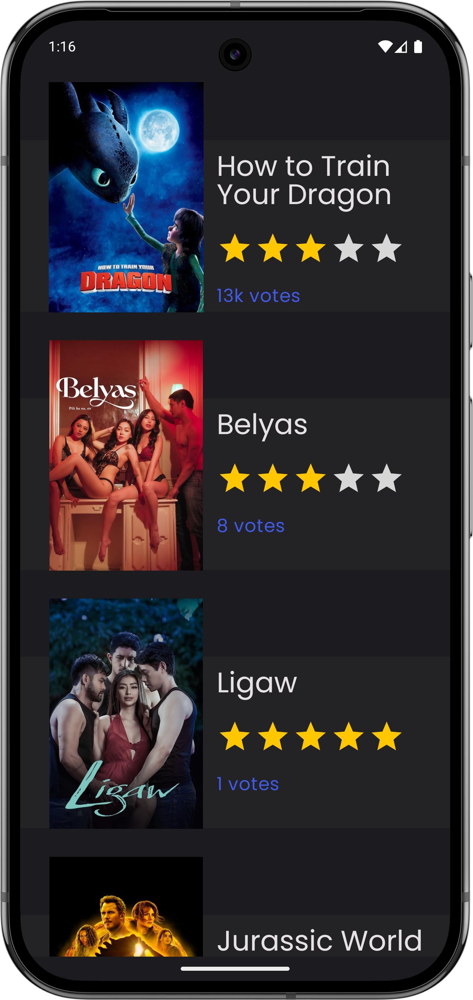
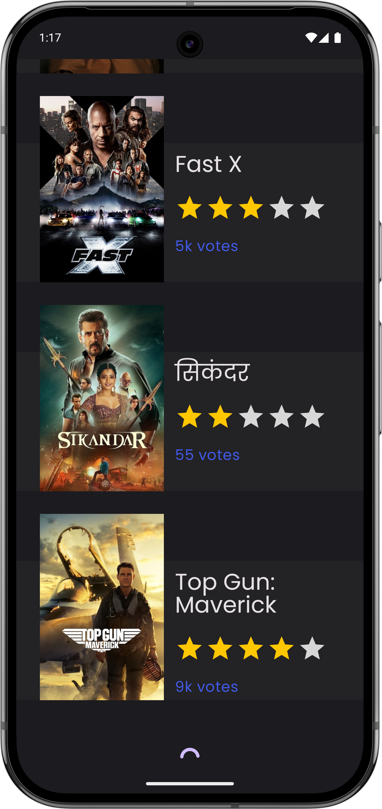

# Cinemate


A simple sample Android app for browsing and discovering popular movies. This project is built with
Kotlin and Jetpack Compose, and is designed to demonstrate how to use Paging 3 in an Android app. If
you're looking for an easy-to-follow android tutorial on paging 3 android with Jetpack Compose, this
is a great place to start.

## Features

- Browse popular movies with infinite scrolling
- Beautiful Material 3 UI
- Robust error handling and retry support
- Paging with local caching
- MVVM architecture with clean separation of concerns

## Screenshots

<table>
  <tr>
    <td>
      
    </td>
    <td>
      
    </td>
  </tr>
</table>

## Tech Stack

- **Kotlin**
- **Jetpack Compose**
- **Paging 3**
- **Room**
- **Ktor Client**
- **Hilt (DI)**
- **Material 3**

## Jetpack Compose Paging 3 Starter Guide for Learners

If you're here to learn how to implement Paging 3 in an Android app using Jetpack Compose, you're in
the right place. If you're only interested in using the app and not the code behind it, feel free to
skip this section.

### To get started:

- Inside this repository, you'll find a folder named tutorial.
- Open that folder and look for a zip file called `cinemate-starter.zip`.
- Unzip it and open the project in Android Studio.
- The project should build and run without any issues.
- Once it launches, you’ll see a simple screen with the text “Starter Project.” If you see that,
  everything’s working fine.

This `cinemate-starter` project is your clean base to follow along with the tutorial. It has all the
necessary setup and dependencies, so you can focus on learning how Paging 3 works with Jetpack
Compose; no extra clutter.

## Hands-On with the App

### Prerequisites

- Android Studio (Meerkat or newer)
- JDK 17+
- Internet connection

### Setup

1. **Clone the repository:**
   ```sh
   git clone git@github.com:probelalkhan/cinemate.git
   cd cinemate
   ```

2. **Open in Android Studio**
3. **Open local.properties (create if it doesn't exist)**
4. **Add your API key:**
   ```
   AUTH_TOKEN=YOUR_AUTH_TOKEN_HERE
   ```
   You can get an API key
   from [The Movie Database (TMDB)](https://www.themoviedb.org/documentation/api).
5. Click Gradle sync.
6. **Run the app**  
   Select a device or emulator and click **Run**.

## Usage

- Browse the list of movies.
- Pull to refresh or use the retry button on errors.

## Project Structure

```
app/
 ├── data/
 ├───── local/
 ├───── remote/
 ├── movies/
 ├── ui/
 └── ...
```

## Contributing

Contributions are welcome!  
Please open issues or submit pull requests for improvements.

## License

This project is licensed under the MIT License.

---

**Made with ❤️ by [probelalkhan](https://github.com/probelalkhan)**
